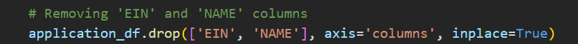
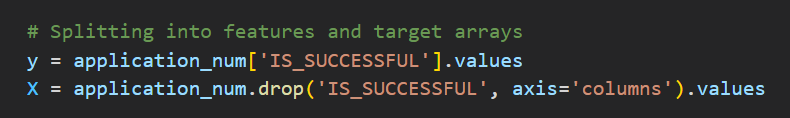
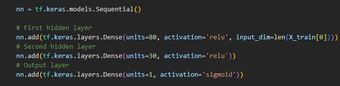
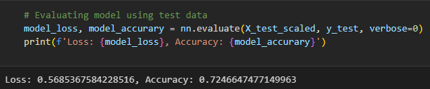
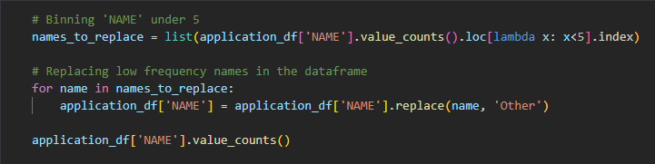
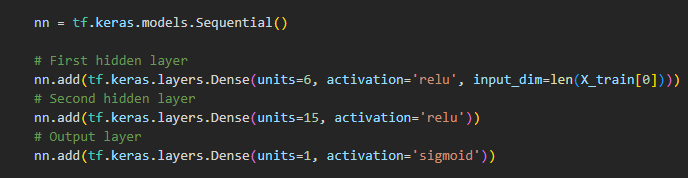
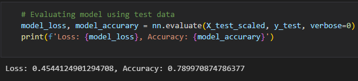

# AlphabetSoup Neural Network Model

## Overview
Nonprofit foundation Alphabet Soup is looking for a tool to predict whether applicants they fund will be successful. 

The neural network model is based on a [CSV](Resources/charity_data.csv) containing data on organizations that have received funding. Included columns:

* `EIN` and `NAME` - Identification columns
* `APPLICATION_TYPE` - Alphabet Soup application type
* `AFFILIATION` - Affiliated sector of industry
* `CLASSIFICATION` - Government organization classification
* `USE_CASE` - Use case for funding
* `ORGANIZATION` - Organization type
* `STATUS` - Active status
* `INCOME_AMT` - Income classification
* `SPECIAL_CONSIDERATIONS` - Special considerations for application
* `ASK_AMT` - Funding amount requested
* `IS_SUCCESSFUL` - Was the money used effectively

## Results
### Data Preprocesing

* The columns `EIN` and `NAME` were removed from the input data as they are neither features nor targets.

* The column `IS_SUCCESSFUL` was chosen as the target of the model.
* The remaining columns were chosen as features of the model.

### Compiling, Training, and Evaluating the Model

* 2 hidden layers were applied with a rectified linear unit (ReLU) activation mode; the first hidden layer contains 80 neurons, and the second with 30 neurons. The large number of neurons were chosen to account for as much of the information available as possible. 

* This model was unable to reach the target model performance of 75% accuracy.

### Optimization

* Previously, company names were taken out of consideration in the neural network model. I believe that company prestige may contribute to an application's success. Company names that appeared 5 or more times were kept as is, and companies that appeared less than 5 times were binned into a category called "Other."

* Individual epochs during the fitting stage of the original model were higher than the testing data's accuracy by around 3%, indicating that the model may have overfit the data. To reduce the overfitting, the number of neurons in each hidden layer was reduced from 80 to 6, and 30 to 15 in layers one and two, respectively. 

* The optimized model was able to exceed the target model performance of 75% accuracy.

## Summary
After optimization to include the company names and reduce overall specificity, the model is able to predict whether or not obtained funds are effectively used with approximately 79% accuracy. Because this task ultimately is a classification problem with less than 100,000 samples, an SVC model also could have been used. Support Vector Classification (SVC) determines the optimal "lines" to separate the target outcomes. SVC models are especially successful when the data is high dimensional, like in this case.